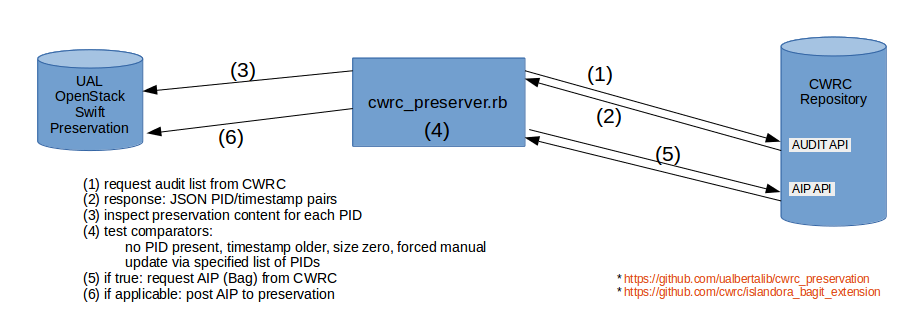
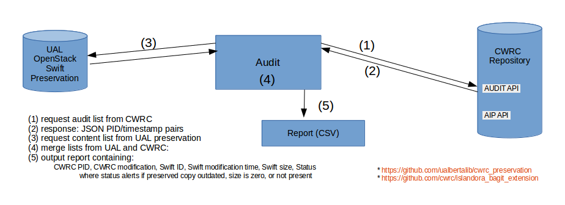

# CWRC Preservation

> :warning: **This command-line script is only compatible with CWRC v1.0** CWRC v2.0 (Islandora v2.0 / Drupal 9+ requires an alternative approach. This repo is minimally supported thus I'm not fixing the URI obsolete warning (`RUBYOPT='-W1'` before the associated command will suppress the warning).


The CWRC Preservation toolkit contains Ruby applications for preserve content from the CWRC (cwrc.ca) repository. The primary objective is to manage the flow of content from the CWRC repository into an OpenStack Swift repository for preservation. Also, the repository provides an application to audit the contents of the source and preserved objects. The preservation tool is meant to run behind a firewall thus pulling content from CWRC.

The two main applications are:

- [cwrc_preserver.rb](#cwrc_preserver.rb) - on-demand preservation
- [cwrc_audit_report.rb](#cwrc_audit_report.rb) - audit report

## Workflow

- cwrc_preserver.rb executes at a regular interval
  - sends request to the CWRC repository with authentication parameters that produces a manifest list of objects residing with the CWRC repository as a response
  - for each CWRC repository object, inspect the preserved object
    - if the preserved copy does not exist or is outdated (comparing CWRC manifest timestamp to the timestamp on the preserved copy, the swift object custom metadata field 'last-mod-timestamp'), request a new AIP (Bag) from the CWRC repository and deposit within the preservation environment
- generate an audit report via cwrc_audit_report.rb
  - sends request to CWRC repository with authentication parameters to produce a manifest list of objects residing with the CWRC repository
  - sends request to preservation environment with authentication parameters to produce a manifest list of objects residing with the preservation environment
  - merge lists and output as a CSV file for interpretation / review (e.g., within a spreadsheet tool)

## Requirements

- Ruby 2.3+

- CWRC API endpoint: https://github.com/cwrc/islandora_bagit_extension

- Configuration file - use [secrets_example.yml](secrets_example.yml) as a starting point and the `-C --config PATH` to specify the config file to utilize.

```
# Openstack Swift parameters
SWIFT_AUTH_URL:
SWIFT_USERNAME:
SWIFT_PASSWORD:
SWIFT_USER_DOMAIN_NAME:
SWIFT_PROJECT_DOMAIN_NAME:
SWIFT_PROJECT_DOMAIN_ID:
SWIFT_PROJECT_NAME:
CWRC_SWIFT_CONTAINER:
CWRC_PROJECT_NAME:

# CWRC repository location and credentials
CWRC_HOSTNAME:
CWRC_LOGIN_PATH:
CWRC_PORT:
CWRC_USERNAME:
CWRC_PASSWORD:

# read timeout (in seconds)
CWRC_READ_TIMEOUT:

# working directory for temporary files
CWRC_PRESERVER_WORK_DIR:

# log file directory
CWRC_PRESERVER_LOG_DIR:
# records failed ids (dir + timestamp + SWIFT_ARCHIVE_FAILED)
SWIFT_ARCHIVE_FAILED:
# records successful ids (dir + timestamp + SWIFT_ARCHIVED_OK)
SWIFT_ARCHIVED_OK:
```

## Usage

<a name="cwrc_preserver.rb"/>

### Preservation: cwrc_preserver.rb



This application connects to the CWRC repository and the preservation environment, determines which CWRC objects need preservation (e.g., missing from the preservation environment or the preservation environment contains a stale copy) and deposits a copy within the preservation environment (with CWRC modification time metadata in ['last-mod-timestamp']). Optionally, the command-line allows defining a list of object ids to trigger a forced preservation event for each specified object. The application uses a config file specified on the command-line to contain properties (e.g. authentication). Two files are created:

- swift_archived_objs.txt: lists the IDs, size and archive rate of all CWRC successfully preserved objects,
- swift_failed_objs.txt: lists all CWRC objects that failed preservation - this will need review and are candidates for reprocessing (hence -r parameter)

Common usage:

- query all CWRC repository items and preserve if needed (example #1)
- query CWRC repository items modified since a given date/time and preserve if needed (example #2)
- pass defined list of items and force preservation (example #3)

```
Usage: cwrc_preserver [options]

options:
    -C, --config PATH      Path for YAML config file
    -d, --debug            set log level to debug
    -r, --reprocess=path   process subset of material: path to file containing IDs, one per line
    -s, --start=date/time  process subset of material: objects modified after specified ISO-8601 YYY-MM-DD <timestamp>
    -h, --help
```

#### Examples

Example #1 - process all CWRC repository objects:

```shell
./cwrc_preserver.rb -d --config="/opt/conf/cwrc_preserver_conf.yml" | tee /tmp/stdout_debug.txt
```

Example #2 - process object modified since a given date:

```shell
./cwrc_preserver.rb -d --config="/opt/conf/cwrc_preserver_conf.yml" --start="2018-05-30" | tee /tmp/stdout_debug.txt
```

Example #3 - process objects via a list and with a forced update (i.e., deposit even if pre-exists) where the list of PIDs is contained within a file, one PID per line:

```shell
./cwrc_preserver.rb -d --config="/opt/conf/cwrc_preserver_conf.yml" --reprocess=/tmp/cwrc_pid_list_one_per_line | tee /tmp/stdout_debug.txt
```

<a name="cwrc_audit_report.rb"/>

### Reporting / Auditing: cwrc_audit_report.rb

# 

```shell
Usage: cwrc_audit_report [options]
    -C, --config PATH                Path for YAML config file
    -s, --summary                    Summary output where status is not 'ok'
    -h, --help                       Displays help
```

Builds a CSV formatted audit report comparing content within the CWRC repository relative to UAL's OpenStack Swift preserved content.

The report pulls input from two disparate sources: CWRC repository and UAL OpenStack Swift preservation service. The report links the content based on object id and outputs the linked information in csv rows that included the fields: the CWRC object PIDs and modification date/times, UAL Swift ID, modification time (metadata['last-mod-timestamp']), and size along with a column indicating the preservation status (i.e., indicating if modification time comparison between Swift and CWRC indicates a need for preservation, or if the size of the Swift object is zero, etc).

The output format is CSV with the following header columns:

```
     CWRC PID,
     CWRC modification,
     Swift ID,
     Swift modification time (metadata['last-mod-timestamp']),
     Swift size,
     Status

     where:
       status =
          if 'x' then needs preservation
           else if 'd' then not present within CWRC
           else if 's' then Swift object is of zero size
           else '' then ok
```

The report is written to stdout

#### Examples

Audit all items

```shell
cwrc_audit_report.rb --config="/opt/conf/cwrc_preserver_conf.yml" | tee /tmp/stdout_debug.txt
```

Audit items with a reported status

```shell
cwrc_audit_report.rb -s --config="/opt/conf/cwrc_preserver_conf.yml" | tee /tmp/stdout_debug.txt
```

### Deprecated: cwrc_reconcile.rb (replaced by cwrc_audit_report.rb)

```shell
cwrc_reconcile.rb
```

This program will print to STDOUT all CWRC objects that are in CWRC but not in SWIFT or have newer modified date in CWRC.
It also creates two output files swift_missing_objs.txt - containing all objects that needs to be archived,
second file swift_objs.txt - listing all CWRC objects that are in SWIFT and have same modified date.

It is recommended that you run it in debug mode for the first time to see what it is doing as it might take long
time to run it. All debug messages redirect to STDOUT by default.

## Development / Testing

to run the test suite:

```bash
  bundle install
  bundle exec rake
```

To run rubocop by itself:

```bash
  bundle exec rubocop
```

## Deployment

**ToDo: refine process**

- Clone GitHub repository
- Populate conf file using an [example](secrets_example.yml) as inspiration and store in a safe directory away from the codebase
- Create a working directory (and record in the config file)
- `bundle install`
- execute `cwrc_preserver.rb` as per examples
- execute `cwrc_audit_report.rb` as per examples (once cwrc_preserver.rb is complete)

- One possibility - ToDo - refine:
  - cron job run once per x weeks - something like based on above examples:
    - `bundle install; bundle exec cwrc_preserver.rb -d --config="/opt/cwrc_conf.yml" 2> /log/cwrc_preserver_$(date -Iseconds).log && bundle exec cwrc_audit_report.rb --config="/opt/cwrc_conf.yml" > /log/cwrc_audit_$(date -Iseconds).log`
    - share the output of CWRC audit report to verify preservation event

### Troubleshooting

## Next steps:

**ToDo: 2018-06-27 - uncertain if still valid**

- Add mysql logging to swift_ingest
- Check tracking in db and verify with info from Swift when checking for duplicates in Swift.
